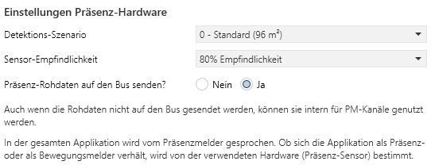
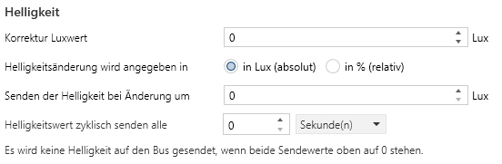
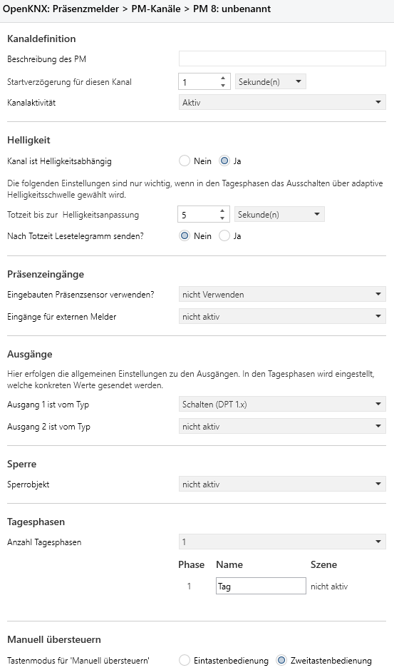
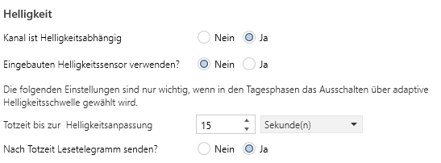
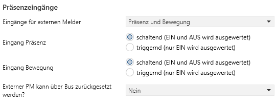
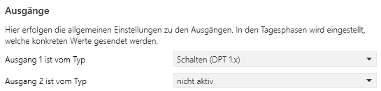
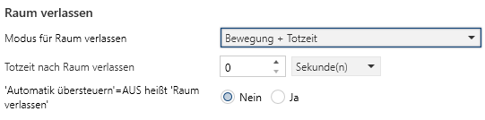
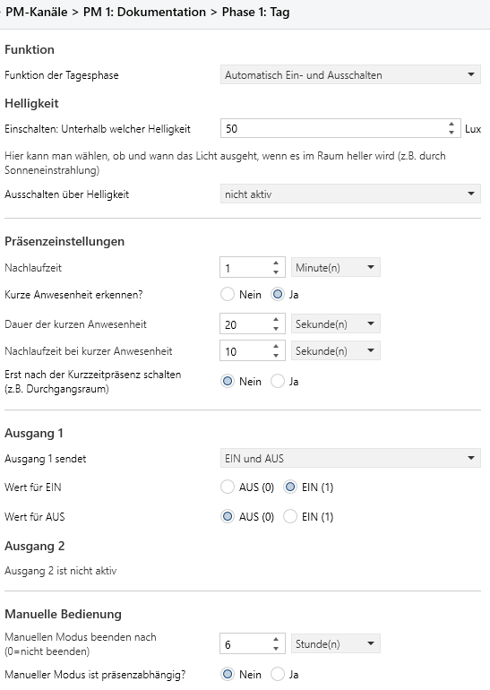
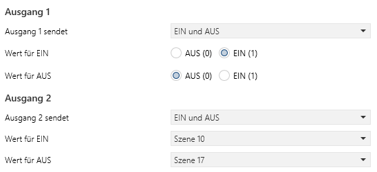
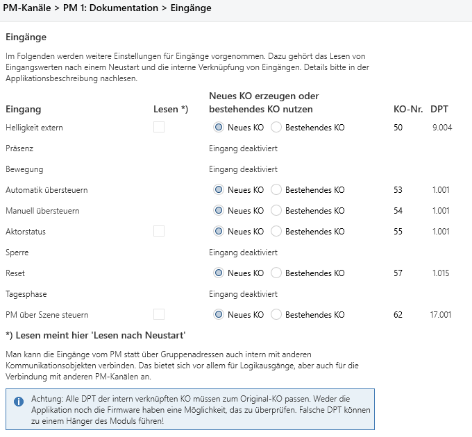

<!-- 
cSpell:words Präsenzmelder Präsenzkanäle Präsenzerkennung Präsenzinformationen Präsenzsensor Präsenzkanälen Präsenzsignal Präsenzinformation Präsenzeingänge präsenzerfassende Präsenzeinstellungen Präsenzsignals präsenzabhängig Präsenzmodul Präsenzmoduls Praesenz
cSpell:words Helligkeitsgesteuert Helligkeitsunabhängig helligkeitsbasierte Luxwert helligkeitsbezogenen Helligkeitsabhängig helligkeitsverändernden
cSpell:words Szenennutzung Szenensteuerung szenensteuerung
cSpell:words Dimmwert Dimmadressen Dimmstatus Dimmaktor Dimmvorgänge Aktorstatus Aktorstatuswechsel Detektions
cSpell:words Moduswechsel Manuellmodus Tagesphasenabhängig Kommunikaitonsobjekte Melderkanal priorität erwartungskonform VEML Eingaenge
-->

# Applikationsbeschreibung Präsenz

Die Applikation Präsenz erlaubt eine Parametrisierung von Kanälen mit Präsenzmelder-Funktionalität mit der ETS.

Sie ist in die Bereiche

* Allgemeine Parameter
* PM-Kanäle
* Logikkanäle

gegliedert, wobei die Präsenzkanäle wiederum in bis zu 20 Kanäle untergliedert sind.

Alle Logikkanäle sind in der [Applikation Logik](https://github.com/OpenKNX/OAM-LogicModule/blob/main/doc/Applikationsbeschreibung-Logik.md) beschrieben.

## Änderungshistorie

Im folgenden werden Änderungen an dem Dokument erfasst, damit man nicht immer das Gesamtdokument lesen muss, um Neuerungen zu erfahren.

01.05.2022: Firmware 0.x.x, Applikation 0.x

* Erste Beta

## Einleitung

Diese Applikation realisiert alle wesentlichen Funktionen eines Präsenz- bzw. Bewegungsmelders. Sie kann mit passender Präsenz- oder Bewegungsmelder-Hardware betrieben werden oder - und das ist das Besondere - auch als "Virtueller Präsenzmelder", indem sie Präsenz-, Bewegungs- und Helligkeitsinformationen über den KNX-Bus empfängt. Somit kann diese Applikation eine Art Update für existierende Präsenzmelder-Hardware darstellen, deren Applikation alt oder ungenügend ist und die gewünschten Funktionen nicht leistet.

Auch wenn im Folgenden immer von Präsenzmelder gesprochen wird, so hängt diese Eigenschaft von der verwendeten Präsenz- bzw. Bewegungserkennung ab. Somit ist aus Sicht der Applikation Präsenz- und Bewegungsmelder synonym zu sehen, die angeschlossene Hardware bestimmt durch ihre Sensitivität, ob es sich um einen Präsenz- oder Bewegungsmelder handelt.

Die Idee zu dieser Applikation ist bei der Verwendung vom True Presence Präsenzmelder entstanden. Dieser hat eine gute bis sehr gute Präsenzerkennung, einen mittelmäßigen Helligkeitssensor und eine schlechte Applikation. In Verbindung mit dieser (virtuellen) Applikation funktioniert er wesentlich besser und kann dann sogar zusätzliche Funktionen wie Kurzzeit-Präsenz.

Diese Präsenzmelder-Applikation implementiert folgende Funktionen:

* "Normaler Präsenzmelder" mit
  * schalten bei Bewegung
  * ausschalten nach einer gewissen Nachlaufzeit
  * Helligkeitsgesteuert oder Helligkeitsunabhängig
  * 2 Ausgängen pro Kanal mit unterschiedlichen DPT

* Virtueller PM: Verwendbar mit einem oder mehreren Slaves
  * PM ist dann Master für alle Slaves
  * Das Präsenz-Signal kann schaltend oder triggernd sein
  * Helligkeit kann vom gleichen Slave kommen oder von irgendeinem anderen Helligkeitssensor
  * Falls die externe Quelle getrennt Bewegungs- und Präsenzinformationen liefern kann, wird das in dafür geeigneten Funktionen berücksichtigt.

* Tagesphasen
  * Es wird nicht nur Tag/Nacht, sondern bis zu 4 Tagesphasen unterstützt (Morgens, Tag, Abend, Nacht)
  * Tagesphasen können beliebig benannt werden
  * Jede Tagesphase unterstützt eigene Nachlaufzeiten, Helligkeiten, Kurzzeitpräsenz

* Innovative Adaptive Ausschaltschwelle über Helligkeit
  * Erlaubt absolute oder relative Helligkeitsschwellen
  * Abschaltung bei externen Lichteinflüssen
  * Beachtet mehrere Lichtkanäle

* Automatik- und Manuell- und Sperrmodus
  * Der Moduswechsel ist über Ein- und Zweitastenbedienung vorgesehen
  * Der Moduswechsel kann auch über Szenen vorgenommen werden
  * Einstellbare Rückfallzeiten für Manuell- oder Sperrmodus

* Innovative "Raum verlassen"-Funktion
  * Erlaubt dem Melder die Unterscheidung zwischen "Licht aus und im Raum bleiben" und "Licht aus und Raum verlassen".
  * Schaltet damit Licht genau dann ein, wenn man es benötigt

* Viele Parameter über GA modifizierbar
  * aktuelle Helligkeitsschwelle
  * aktuelle Nachlaufzeit
  * aktuelle Tagesphase
  * Sensibilität des HF-Sensors
  * Szenario für HF-Sensor

* Logikmodul mit vielen weiteren Funktionen
  * mit dem integrierten Logikmodul können weitere Funktionen in den PM integriert werden

### Tagesphasen

Jeder PM-Kanal unterstützt bis zu 4 Tagesphasen, die frei benannt werden können und unterschiedliches Ein- und Ausschaltverhalten erlauben. Benötigt man nur 2 Phasen, kann man diese auch als Tag-/Nachtphase nutzen.

Mehr als 2 Phasen eignen sich z.B. für

* Morgens: Sehr helles Licht (zum aufwachen und frühstücken)
* Tag: Kurze Nachlaufzeit, also schnelles abschalten nach manuellem einschalten
* Abends: Über Szene mehrere Lichtkreise einschalten, alle Lichtkreise abschalten
* Nachts: Nur stark gedimmtes Licht für die Orientierung, kurze Nachlaufzeit

Der Phantasie sind hier keine Grenzen gesetzt. Die Phasen können auch ganz anders heißen, z.B. Normal, Fernsehen, Lesen und Nacht. Mit dem integrierten Logikmodul können die Phasen passend über Zeitschaltuhren oder entsprechende Logikfunktionen aktiviert werden.

### Adaptive Ausschaltschwelle über Helligkeit

Die Hauptanwendung für einen Präsenzmelder ist immer noch das Schalten von Licht. Während sich die meisten Personen, die neu im Bereich Hausautomatisierung sind, Gedanken darüber machen, wann das Licht eingeschaltet werden soll und wann nicht, ist die größte Herausforderung, wann das Licht ausgeschaltet werden soll. Die erste (laienhafte) Idee hierzu ist: "Wenn ich nicht im Raum bin", allerdings ist das zu kurz gedacht.

Die Information "Wenn ich nicht im Raum bin" hängt von der Qualität der Präsenzerkennung ab und es gibt viele Stellschrauben wie Nachlaufzeit, Empfindlichkeit, Kurzzeitpräsenz, die eine individuelle und zufriedenstellende Einstellung hierzu erlauben, auch bei diesem Präsenzmelder.

Dem 2. Aspekt für das Ausschalten des Lichts - "Wenn es wieder hell genug ist" - wird hingegen bei derzeit verfügbaren Produkten am Markt sehr wenig Aufmerksamkeit geschenkt. Die Situation ist einfach zu motivieren:

Man kommt morgens ins Esszimmer zum Frühstück, es dämmert draußen, das Licht wird vom PM eingeschaltet, da es noch nicht hell genug ist. Während des Frühstücks wird es heller und die Helligkeit von außen wird so hoch, dass sie das Licht im Raum überflüssig macht. Jetzt sollte der PM das Licht ausschalten.

Es gibt Präsenzmelder, die eine helligkeitsbasierte Ausschaltschwelle erlauben. Leider ist diese häufig statisch und unflexibel. Hat man mehrere Lichtkreise im Raum, kann diese statisch eingestellte Helligkeitsschwelle nicht unterscheiden, ob es heller geworden ist, indem jemand einen weiteren Lichtkreis eingeschaltet hat oder weil die Sonne jetzt stärker scheint. Im ersten Fall will man das Licht natürlich nicht ausschalten, im letzteren schon.

Die in diesem Melder eingebaute adaptive Ausschaltschwelle berücksichtigt genau dieses Problem und erlaubt eine smarte Abschaltung des Lichts unter Berücksichtigung beliebig vieler Lichtkreise und verschiedener Möglichkeiten der Helligkeitsänderung mittels schalten, dimmen und Szenennutzung.

Die Grundidee ist einfach: Nach dem Einschalten von einem oder mehreren Lichtkreisen wird ein Moment gewartet, bis der Lichtsensor die aktuelle Helligkeit im Raum gemessen hat und dem PM gemeldet hat. Jetzt wird die Ausschaltschwelle berechnet: Der Benutzer hat in der Applikation festgelegt "Um wie viel heller darf es werden?". Dieser Wert wird zur aktuellen Helligkeit addiert und das als neue Ausschaltschwelle festgelegt. Darf es um 20 Lux heller werden und es wurden 127 Lux gemessen, so ist die Ausschaltschwelle 147 Lux.

Erhöht sich die Helligkeit im Raum durch das Sonnenlicht auf 150 Lux, würde das Licht ausgeschaltet werden, da es jetzt heller ist als durch die Beleuchtung im Raum.

Erhöht sich die Helligkeit im Raum durch eine Szene (die eine weitere Lichtquelle auf 50% dimmt) auf 150 Lux, würde der PM eine neue Ausschaltschwelle berechnen (150 Lux + 20 Lux = 170 Lux). Das passiert dadurch, dass der PM auf alle Schalt-, Dimm- und Szenen-Signale aller Lichtquellen im Raum hörend reagiert. Die neue Schwelle würde somit eine Lichtabschaltung durch weitere Lichtquellen verhindern. Würde das Sonnenlicht jetzt die Raumhelligkeit auf 171 Lux bringen, würde auch hier wieder das Licht ausgeschaltet werden.

Da man nicht mit jeder Wolke, die vorüber zieht, sein aktuelles Lichtambiente ausgeschaltet bekommen will, kann man auch eine Nachlaufzeit einstellen, in der die Ausschaltschwelle überschritten werden darf, bevor das Licht ausgeschaltet wird. Ist diese Nachlaufzeit z.B. 5 Minuten, muss im obigen Beispiel die Helligkeit von 170 Lux 5 Minuten lang überschritten sein, bevor das Licht ausgeschaltet wird.

Die Einstellungen für die adaptive Ausschaltschwelle sind Tagesphasenabhängig und können somit in den Morgenstunden anders definiert werden als in den Tages- oder Abendstunden.

### **Automatik-, Manuell- und Sperrmodus**

Egal wie gut ein PM ist und wie aufwändig alles parametriert ist, aktuelle Wünsche des Benutzers werden immer dem Melder mitgeteilt werden müssen.

Dies versetzt dann den Melder in einen bestimmten Sondermodus, der den aktuellen Benutzerwunsch repräsentiert.

#### **Sperrmodus**

Wie jeder andere Präsenzmelder kann auch dieser PM gesperrt werden. Eine Sperre ist eine Funktion mit sehr hoher Priorität, die alle anderen Funktionen des PM deaktiviert. Es werden somit jegliche Präsenz- oder Helligkeitsinformationen wie auch niedriger priorisierte Benutzeraktionen ignoriert.

Eine Sperre kann nur durch einen Entsperrbefehl oder automatisch nach der eingestellten Rückfallzeit aufgehoben werden.

#### **Manuellmodus**

Der Manuellmodus ist ähnlich dem Sperrmodus, allerdings mit geringerer Priorität und flexibler. 

#### **Automatikmodus**

Folgende Situation: Man sitzt abends zusammen und möchte bei Kerzenschein gemütlich einen Wein trinken. Da es dunkel ist, hat der Melder die Beleuchtung bereits eingeschaltet, man möchte also das Licht ausschalten, um die Kerzen zur Geltung kommen zu lassen.

Andere Situation: Man kommt morgens zum Frühstück. Es ist noch dämmerig, aber schon so hell, dass der Melder das Licht nicht angemacht hat. Subjektiv ist es aber zu dunkel und man möchte das Licht einschalten, damit man gemütlich frühstücken kann.

Klassische Melder bieten für so etwas Sperren an, die den Melder deaktivieren. Damit kann natürlich die gewünschte Lichtsituation (abends manuell ausschalten, morgens manuell einschalten) erreicht werden.

Eine Sperre ist aber in einer solchen Situation meist ein viel zu grobes Werkzeug und hat einige Nachteile:

* Es muss zuerst die Sperre aktiviert werden
* dann muss der gewünschte Lichtzustand eingestellt werden
* Der Melder verliert durch die Sperre jegliche Funktionalität
* Man muss explizit dran denken, dass man beim Verlassen des Raumes noch eine aktive Sperre hat und diese deaktivieren
* und nach den deaktivieren der Sperre muss man auch noch das Licht ausmachen.

## **Allgemeine Parameter**

<kbd></kbd>
Hier werden Einstellungen getroffen, die die generelle Arbeitsweise des Präsenzmelder-Moduls bestimmen.

## Gerätestart

### **Zeit bis das Gerät nach einem Neustart aktiv wird**

Hier kann man festlegen, wie viel Zeit vergehen soll, bis das Gerät nach einem Neustart seine Funktion aufnimmt. Dabei ist es egal, ob der Neustart durch einen Busspannungsausfall, einen Reset über den Bus, durch ein Drücken der Reset-Taste oder durch den Watchdog ausgelöst wurde.

Da das Gerät prinzipiell (sofern parametriert) auch Lesetelegramme auf den Bus senden kann, kann mit dieser Einstellung verhindert werden, dass bei einem Busneustart von vielen Geräten viele Lesetelegramme auf einmal gesendet werden und so der Bus überlastet wird.

**Anmerkung:** Auch wenn man hier technisch bis zu 16.000 Stunden Verzögerung angeben kann, sind nur Einstellungen im Sekundenbereich sinnvoll.

### **In Betrieb senden alle**

Das Gerät kann einen Status "Ich bin noch in Betrieb" über das KO 1 senden. Hier wird das Sendeintervall eingestellt.

Sollte hier eine 0 angegeben werden, wird kein "In Betrieb"-Signal gesendet und das KO 1 steht nicht zur Verfügung.

### **Uhrzeit und Datum nach einem Neustart vom Bus lesen**

Dieses Gerät kann Uhrzeit und Datum vom Bus empfangen. Nach einem Neustart können Uhrzeit und Datum auch aktiv über Lesetelegramme abgefragt werden. Mit diesem Parameter wird bestimmt, ob Uhrzeit und Datum nach einem Neustart aktiv gelesen werden.

Wenn dieser Parameter gesetzt ist, wird die Uhrzeit und das Datum alle 20-30 Sekunden über ein Lesetelegramm vom Bus gelesen, bis eine entsprechende Antwort kommt. Falls keine Uhr im KNX-System vorhanden ist oder die Uhr nicht auf Leseanfragen antworten kann, sollte dieser Parameter auf "Nein" gesetzt werden.

## **Experteneinstellungen**

Die Experteneinstellungen kommen aus der [Applikation Logik](https://github.com/OpenKNX/OAM-LogicModule/blob/main/doc/Applikationsbeschreibung-Logik.md) und können dort nachgelesen werden.

## **PM-Kanäle**

Unter diesem Tab sind alle Einstellungen für den Präsenzmelder zusammengefasst. Jeder der folgenden Tabs wird in einem eigenen Kapitel beschrieben.

### **PM-Hardware**

Da diese Applikation auch als virtueller Präsenzmelder fungieren kann, ist keine Präsenz-Hardware notwendig. Falls aber Präsenz-Hardware vorhanden ist, können auf dieser Seite deren Grundfunktionen parametriert werden. Diese Hardware kann dann bei den einzelnen PM-Kanälen weiterhin genutzt werden.

### Präsenz-Hardware

<kbd></kbd>

#### **Präsenz-Sensor**

Der vorhandene Präsenz-Sensor kann hier ausgewählt werden. Derzeit werden entweder ein PIR-Sensor oder der HF-Sensor MR24xxB1 unterstützt.

#### **Helligkeits-Sensor**

Der vorhandene Helligkeits-Sensor kann hier ausgewählt werden. Derzeit werden entweder der VEML7700 oder der OPT3001 unterstützt.

### Einstellungen Präsenz-Hardware

Erscheint nur, wenn ein Hardware-Präsenzsensor ausgewählt ist.

<kbd></kbd>

#### **Detektions-Szenario**

Erscheint nur, wenn als Hardware-Präsenzsensor der HF-Sensor ausgewählt worden ist.

Hier kann man das vom Hersteller des HF-Sensors vorgesehene Szenario für die Detektion von Präsenz auswählen, das nach einem Neustart zur Verfügung steht. Die aufgeführten Werte sind dem technischen Dokument entnommen, inclusive der angenommenen Montage. Inwiefern das zum realen Einsatzort passt, können wir derzeit nicht beurteilen. Aktuelle Empfehlung ist, die Werte durchzuprobieren, bis man ein für sich passendes Erfassungsszenario gefunden hat. 

Der Wert "Letzter gesetzter Wert" nimmt bei einem Neustart den Wert für Szenario, der vor dem Neustart gesetzt war.

Der Wert für das Szenario kann auch über das KO 26 (Eingang Szenario) gesetzt werden mit den Werten 0 bis 6. Das KO 26 erscheint nur, wenn "Präsenz-Rohdaten auf den Bus senden" ausgewählt ist.

#### **Sensor-Empfindlichkeit**

Erscheint nur, wenn als Hardware-Präsenzsensor der HF-Sensor ausgewählt worden ist.

Hier kann die Sensor-Empfindlichkeit in 10%-Stufen eingestellt werden. 100% ist volle Empfindlichkeit, 10% ist 1/10 der vollen Empfindlichkeit. Eine niedrige Empfindlichkeit bedeutet geringe Präsenzerkennung, aber auch geringe Störeinflüsse. Eine hohe Empfindlichkeit bedeutet gute Präsenzerkennung, aber auch eine hohe Wahrscheinlichkeit von Störeinflüssen (z.B. Wind, Luftzug). Man sollte die Empfindlichkeit nach dem Motto 

> So empfindlich wie nötig, aber so gering wie möglich

wählen.

Die Empfindlichkeit kann auch über das KO 27 (Eingang Empfindlichkeit) mit den Werten 1-10 gesetzt werden (wobei 1=10% bis 10=100% ist). Das KO 27 erscheint nur, wenn "Präsenz-Rohdaten auf den Bus senden" ausgewählt ist.

#### **Präsenz-Rohdaten auf den Bus senden?**

Der Präsenzsensor kann seine Daten direkt auf den Bus senden, ohne jegliche Präsenzmelder-Funktionalität "dazwischen". Diese Daten umfassen Informationen wie Präsenz, Bewegung, Bewegungsmoment, Bewegungsrichtung (auf den Sensor zu oder von ihm weg). Mit einem Ja werden entsprechende Kommunikationsobjekte freigeschaltet, die diese Daten senden.

### Helligkeit

Erscheint nur, wenn ein Hardware-Helligkeitssensor ausgewählt ist.

<kbd></kbd>

#### **Korrektur Luxwert**

Der vom Helligkeitssensor gemessene Luxwert kann hier korrigiert werden. Der auf den Bus gesendete Luxwert wird um den hier eingestellten Wert erhöht.

Wird 10 Lux eingestellt und 20 Lux gemessen, wird auf den Bus 30 Lux gesendet.
Wird -10 Lux eingestellt und 50 Lux gemessen, wird auf den Bus 40 Lux gesendet.
Für alle Werte, die rechnerisch einen negativen Wert ergeben, wird 0 Lux gesendet.

#### **Helligkeitsänderung wird angegeben in**

Die gemessene Helligkeit kann auf den Bus gesendet werden. Dazu muss man im nächsten Feld angeben, um welchen Wert sich die Helligkeit ändern muss, bevor sie gesendet wird. Die Änderung kann man absolut (in Lux) oder relativ (in %) angeben. Hier wählt man diese Angabe aus.

#### **Senden der Helligkeit bei Änderung um**

Die gemessene Helligkeit kann auf den Bus gesendet werden. Je nach Auswahl im vorherigen Feld (relativ oder absolut) kann man hier den Änderungswert eingeben bei dessen überschreiten auf den Bus gesendet wird.

##### **absolut (in Lux)**

Wird 10 Lux eingestellt und der letzte gesendete Wert war 50 Lux, dann wird ein neues Telegramm gesendet, sobald ein Wert kleiner oder gleich 40 Lux bzw. größer oder gleich 60 Lux gemessen wird.

##### **relativ (in %)**

Wird 10 % eingestellt und der letzte gesendete Wert war 50 Lux, dann wird ein neues Telegramm gesendet, sobald ein Wert kleiner oder gleich 45 Lux bzw. größer oder gleich 55 Lux gemessen wird, da 10% von 50 Lux genau 5 Lux entsprechen.

Unabhängig vom Senden der Werte auf den Bus kann die Helligkeit bei den Präsenzkanälen herangezogen werden.

#### **Helligkeitswert zyklisch senden**

Die gemessene Helligkeit kann auf den Bus gesendet werden. Mit dieser Einstellung wird das Zeitintervall zum erneuten Senden festgelegt.

Wird das Zeitintervall von 2 Minuten eingestellt, wird alle 2 Minuten die aktuell gemessene Helligkeit auf den Bus gesendet.

Wird während eines Zeitintervalls die Helligkeit wegen Änderung gesendet, so beeinflusst das nicht das Zeitintervall. Es kann somit passieren, dass kurz vor oder nach dem zyklischen Senden erneut wegen einer Änderung der Helligkeit gesendet wird.

> Wenn weder zyklisch noch aufgrund von einer Änderung gesendet werden soll (beide Werte auf 0), wird die Helligkeit gar nicht aktiv auf dem Bus gesendet. Sie kann immer noch über ein Lesetelegramm gelesen werden.

### LED

Erscheint nur, wenn irgendeine Präsenz-Hardware ausgewählt wurde.

<kbd></kbd>

Die beiden Auswahlfelder **LED Präsenz** und **LED Bewegung** steuern vorhandene Hardware-LED. Für beide stehen folgende Auswahlmöglichkeiten zur Verfügung.

Unabhängig von der Einstellung kann für jede Tagesphase eines jeden Kanals eine Sperre für die LEDs eingestellt werden, die ein aufleuchten verhindert.

#### **nicht aktiv**

Die zugehörige LED wird nicht von der Firmware gesteuert.

#### **aktiv bei Bewegung**

Die zugehörige LED geht an, sobald von der Hardware eine Bewegung festgestellt wird und geht erst aus, nachdem die Hardware keine Bewegung mehr meldet.

#### **aktiv bei Präsenz**

Die zugehörige LED geht an, sobald von der Hardware eine Präsenz festgestellt wird und geht erst aus, nachdem die Hardware keine Präsenz mehr meldet.

Ein Präsenzsignal wird derzeit nur vom HF-Sensor erzeugt. Bei einem PIR-Sensor ist kein Präsenzsignal verfügbar.

#### **aktiv über externes Objekt**

Wird diese Einstellung gewählt, erscheint ein zusätzliches Kommunikationsobjekt, das die Steuerung dieser LED über den KNX-Bus erlaubt.

## **PM*x*: *unbekannt***

Hier werden alle kanalspezifischen Präsenzmelder-Einstellungen vorgenommen. Da alle Kanäle identisch sind, wird nur ein Kanal beschrieben.

Das *x* ist eine Zahl und steht für die Nummer des Kanals, der definiert wird.

Der Text *unbekannt* wird durch die Beschreibung des Kanals ersetzt, sobald eine Beschreibung vergeben wurde.

<kbd></kbd>

Auf der Hauptseite werden globale Einstellungen für den gesamten Kanal vorgenommen und die Anzahl der Tagesphasen definiert. Spezielle Tagesphasen-Einstellungen werden auf weiteres Unterseiten vorgenommen.

Ein Kanal kann nicht nur über Kommunikationsobjekte, sondern auch über Szenen gesteuert werden. Dafür steht eine weitere Seite "Szenensteuerung" zur Verfügung.

Für erfahrene Benutzer besteht noch die Möglichkeit, Präsenzmelder-Funktionen mit Logikfunktionen zu verknüpfen, ohne alle Telegramme über den Bus zu senden. Diese Funktionalität heißt "Interne Eingänge" und steht auf einer eigenen Seite zur Verfügung.

## Kanaldefinition

Die Angaben hier gelten zur Identifizierung und für das Grundverhalten des Kanals.

<kbd></kbd>

### **Beschreibung des PM**

Der hier angegebene Name wird an verschiedenen Stellen verwendet, um diesen Kanal wiederzufinden.

* Seitenbeschreibung des Kanals: Der Text *unbekannt* wird ersetzt
* Name vom Kommunikationsobjekt: Statt "PM *x*" wird der Text benutzt

Eine aussagekräftige Benennung erlaubt eine einfachere Orientierung innerhalb der Applikation, vor allem wenn man viele Kanäle nutzt.

### **Startverzögerung für diesen Kanal**

Neben "Allgemeine Parameter -> Zeit bis das Gerät nach einem Neustart aktiv wird" kann auch noch pro Kanal eine Startverzögerung sinnvoll sein.

Die Verzögerungszeit wird hier angegeben.

**Anmerkung:** Auch wenn man hier technisch bis zu 16.000 Stunden Verzögerung angeben kann, sind nur Einstellungen im Sekundenbereich sinnvoll.

### **Kanalaktivität**

Hier kann man einen PM-Kanal aktivieren.

#### **Inaktiv**

Dieser Kanal ist inaktiv. Alle Einstellungen und alle Kommunikaitonsobjekte sind ausgeblendet.

#### **Aktiv**

Dieser Kanal ist aktiv und kann normal parametrisiert werden.

#### **Funktionslos**

Dieser Kanal ist inaktiv. Er kann vollständig definiert sein und keine Einstellung geht verloren, aber es wird kein Telegramm empfangen oder gesendet. Dies bietet die Möglichkeit, zu Testzwecken einen bereits parametrierten Kanal inaktiv zu setzen, um zu schauen, ob er die Ursache für eventuelles Fehlverhalten im Haus ist. Kann zur Fehlersuche hilfreich sein.

## Helligkeit

Hier erfolgen die helligkeitsbezogenen Einstellungen für diesen Kanal.

<kbd></kbd>

### **Kanal ist Helligkeitsabhängig**

Ein PM-Kanal berücksichtigt normalerweise eine gemessene Helligkeit bei seinen Ein- und Ausschalt-Vorgängen. Es gibt auch Anwendungsfälle, die unabhängig von der Helligkeit funktionieren sollen, so ist z.B. das Ein- bzw. Ausschalten einer Klimaanlage bei Anwesenheit eher von der Temperatur als von der Helligkeit abhängig.

Wählt man hier Ja, wird die Helligkeit in den vorgegebenen Grenzen zum Schalten berücksichtigt, bei einem Nein wird keine Helligkeit berücksichtigt.

Die eigentlichen Helligkeitsgrenzen zum Ein- und Ausschalten sind abhängig von der Tagesphase und werden dort definiert.

### **Eingebauten Helligkeitssensor verwenden?**

Erscheint nur, wenn unter PM-Hardware ein Helligkeitssensor ausgewählt wurde.

### **Totzeit bis zur Helligkeitsanpassung**

Diese Einstellung ist nur wichtig, wenn die [adaptive Ausschaltschwelle](#adaptive-ausschaltschwelle) genutzt werden soll.

Ändert sich die Helligkeit im Raum, indem ein weiterer Lichtkreis ein-, ausgeschaltet oder gedimmt wurde, benötigt der entsprechende Helligkeitssensor eine gewisse Zeit, um die neue Helligkeit zu messen. Erst danach macht es Sinn, eine neue Ausschaltschwelle für das Licht zu berechnen.

Die hier angegebene Zeit ist die Pause, in der auf einen neuen Helligkeitswert gewartet wird.

### **Nach Totzeit Lesetelegramm senden?**

Es kann sein, dass ein Helligkeitssensor während der Totzeit eine Helligkeitsänderung nicht von sich aus sendet. Um wirklich einen neuen Helligkeitswert zu erhalten, kann man den PM veranlassen, ein Lesetelegramm zu schicken.

Eine neue Ausschaltschwelle wird erst berechnet, wenn ein neuer Helligkeitswert empfangen wurde.

## Präsenzeingänge

Hier kann bestimmt werden, ob und wie die Präsenzinformation von externer oder interner Hardware zu dem Melderkanal gelangt.

<kbd></kbd>

Alle Präsenzinformationen werden über ein logisches ODER verarbeitet, eine Nachlaufzeit beginnt erst, wenn alle Präsenzeingänge eine 0 liefern.

### **Eingang Präsenz A/B**

Es gibt 2 Kommunikationsobjekte, die Präsenzinformationen von einem externen Melder empfangen können. Die Werte können wie folgt belegt werden.

#### **nicht aktiv**

Dieser Eingang ist nicht aktiv und kann keine Präsenzinformationen erhalten. Das entsprechende Kommunikationsobjekt ist deaktiviert.

#### **schaltend (EIN und AUS wird ausgewertet)**

Der externe Sensor liefert die Präsenzinformation als schaltendes Objekt. Solange ein EIN-Signal anliegt, ist Präsenz vorhanden, sobald ein AUS empfangen wird, ist die Präsenz weg und die Nachlaufzeit läuft an.

#### **triggernd (nur EIN wird ausgewertet)**

Der externe Sensor liefert die Präsenzinformation als Trigger. Sobald ein EIN-Signal anliegt, ist Präsenz vorhanden und die Nachlaufzeit läuft an. Ein erneutes EIN setzt die Nachlaufzeit zurück, d.h. sie läuft erneut an.

Der externe Sensor muss sicherstellen, dass er valide Präsenzinformationen häufiger sendet als die minimale Nachlaufzeit, die verwendet wird. Empfohlen wird ein zyklisches senden, mindestens doppelt so häufig wie die Nachlaufzeit.

> Achtung: Aus technischen Gründen wird bei triggerndem Betrieb das Eingangs-KO nach dem Empfangen einer 1 sofort wieder auf 0 gesetzt. Da dies ein Eingang ist, hat das üblicherweise keinerlei Auswirkungen. Da dieser Eingang aber auch ein interner Eingang sein kann, könnte eine solche 0 Auswirkungen auf das Quell-KO haben.

## Ausgänge

Hier definiert man die Ausgänge für diesen Kanal.

<kbd></kbd>

Es gibt 2 Ausgänge, die identisch funktionieren. Hier werden nur die technischen Eigenschaften der Ausgänge spezifiziert. Welche konkreten Werte vom PM gesendet werden, wird von der jeweiligen Tagesphase bestimmt.

### **Ausgang 1/2 ist vom Typ**

Hier wird der Datentyp des Ausgangs bestimmt. Folgende Werte sind möglich

#### **nicht aktiv**

Der Ausgang ist nicht aktiv und kann nichts senden. Das entsprechende Kommunikationsobjekt ist deaktiviert.

#### **Schalten (DPT 1.x)**

Der Ausgang ist schaltend.

#### **Wert (DPT 5.x)**

Der Ausgang sendet einen Wert 0..255.

#### **Szene (DPT 17.001)**

Der Ausgang sendet eine Szene.

#### **Dimmen absolut (DPT 5.001)**

Der Ausgang sendet einen Dimmwert 0%..100%.

### **Ausgang 1/2 sendet zyklisch**

Man kann den Ausgang den letzten Wert wiederholt senden lassen.

### **zyklisch senden alle**

Erscheint nur, wenn zyklisch senden aktiv ist.

Hier wird das Zeitintervall angegeben, in dem der Ausgangswert wiederholt werden soll.

## Sperre

Hier wird eingestellt, auf welche Art und Weise der Kanal gesperrt werden kann.

<kbd></kbd>

### **Sperrobjekt**

Man kann bei diesem Melder verschiedene Arten von Sperren definieren. Solange der Melder im Sperrmodus ist, sendet er keine Telegramme am Ausgang.

#### **nicht aktiv**

Die Sperre ist nicht aktiviert. Das entsprechende Kommunikationsobjekt ist deaktiviert.

#### **Zwangsführung**

Es wird ein Zwangsführungsobjekt DPT 2 sichtbar. Mit den entsprechenden Zwangsführungssignalen kann folgendes Verhalten bewirkt werden:

* normal, AUS (00) - Der Melder geht in den Automatik-Modus und schaltet aus
* normal, EIN (01) - Der Melder geht in den Automatik-Modus und schaltet ein
* priorität, AUS (10) - Der Melder geht in den Sperrmodus und schaltet aus
* priorität, EIN (11) - Der Melder geht in den Sperrmodus und schaltet ein

#### **Sperre**

Es wird ein Sperrobjekt DPT 1 sichtbar. Beim Empfang des entsprechenden Sperrsignals wird die Sperre aktiviert bzw. deaktiviert.

### **Sperraktivität**

Erscheint nur, wenn das Sperrobjekt "Sperre" eingestellt ist.

#### **gesperrt (1) / nicht gesperrt (0)**

Eine Sperre wird durch ein EIN-Telegramm ausgelöst, eine Freigabe durch ein AUS-Telegramm.

#### **gesperrt (0) / nicht gesperrt (1)**

Eine Sperre wird durch ein AUS-Telegramm ausgelöst, eine Freigabe durch ein EIN-Telegramm.

### **Beim EINschalten wird**

Erscheint nur, wenn das Sperrobjekt "Sperre" eingestellt ist.

Der Melder kann beim Aktivieren einer Sperre etwas senden lassen, hier wird bestimmt, was passiert.

> Achtung: Ein EIN- bzw. AUS-Signal ist nicht zu verwechseln mit einem EIN- oder AUS-Telegramm. Das entsprechende Signal wird am Ausgang in das passende Telegramm verwandelt, das in der aktuellen Tagesphase für  EIN- bzw. AUS-Signal gesendet werden soll. Ein EIN-Signal kann somit durchaus zu einer Szene 5 und ein AUS-Signal zu einer Szene 17 führen.

#### **nichts gesendet**

Beim Aktivieren der Sperre passiert nichts am Ausgang.

#### **AUS gesendet**

Beim Aktivieren der Sperre wird ein AUS-Signal gesendet.

#### **EIN gesendet**

Beim Aktivieren der Sperre wird ein EIN-Signal gesendet.

### **Beim AUSschalten wird**

Erscheint nur, wenn das Sperrobjekt "Sperre" eingestellt ist.

Der Melder kann beim deaktivieren einer Sperre etwas senden lassen, hier wird bestimmt, was passiert.

> Achtung: Ein EIN- bzw. AUS-Signal ist nicht zu verwechseln mit einem EIN- oder AUS-Telegramm. Das entsprechende Signal wird am Ausgang in das passende Telegramm verwandelt, das in der aktuellen Tagesphase für  EIN- bzw. AUS-Signal gesendet werden soll. Ein EIN-Signal kann somit durchaus zu einer Szene 5 und ein AUS-Signal zu einer Szene 17 führen.

#### **nichts gesendet**

Beim Deaktivieren der Sperre passiert nichts am Ausgang.

#### **AUS gesendet**

Beim Deaktivieren der Sperre wird ein AUS-Signal gesendet.

#### **EIN gesendet**

Beim Deaktivieren der Sperre wird ein EIN-Signal gesendet.

#### **Aktueller Zustand gesendet**

Beim deaktivieren der Sperre wird das Signal gesendet, dass gerade am Ausgang anliegen würde, wenn der Melder nicht gesperrt gewesen wäre.

Somit funktioniert ein gesperrter Melder intern normal weiter und sendet einfach nur keine Telegramme. Bei dieser Einstellung wird beim Entsperren einfach das letzte unterdrückte Signal gesendet.

### **Mit Rückfallzeit?**

Werden Sperren bzw. eine Zwangsführung manuell geschaltet, so ist es nicht ungewöhnlich, dass vergessen wird, diese Sperre/Zwangsführung wieder zu beenden.

Mit dieser Einstellung kann man eine Rückfallzeit aktivieren, nach der der Melder von sich aus die Sperre aufhebt und wieder in den Normalbetrieb geht.

Bei der Aufhebung einer Sperre wird die unter [Beim AUSschalten wird](#beim-ausschalten-wird) definierte Aktion ausgeführt.
Bei der Aufhebung einer Zwangsführung wird in den Zustand "normal, AUS" gesprungen.

### **Rückfall nach**

Hier wird die Rückfallzeit angegeben.

## Tagesphasen

Die Definition der Tagesphasen macht eine wesentliche Funktion des Melders aus.

<kbd></kbd>

Hier werden nur die Anzahl, die Namen und das Verhalten der Tagesphasen definiert, die einzelnen Tagesphasen werden auf eigenen Seiten festgelegt.

Es muss mindestens eine Tagesphase gewählt werden. Diese beinhaltet dann alle Schalteinstellungen. Mit nur einer Tagesphase verhält sich der Melder wie ein "normaler" Melder, der nicht einmal einen Unterschied zwischen Tag und Nacht macht. Der Standard-Name für nur eine Tagesphase ist "Tag", dieser kann natürlich geändert werden.

### **Anzahl der Tagesphasen**

Hier wird die Anzahl der Tagesphasen angegeben, es muss mindestens eine Tagesphase geben. Das Maximum sind 4 Tagesphasen.

Sobald mehr als eine Tagesphase möglich ist, wird ein zusätzliches Kommunikationsobjekt "Tagesphase" freigeschaltet, dass eine Szene empfangen kann. Tagesphasen können somit über Szenen umgeschaltet werden.

### **Neue Tagesphase übernehmen**

Erscheint nur bei mehr als einer Tagesphase.

Sobald man zwischen verschiedenen Tagesphasen umschalten kann, kann man hier festlegen, wann die neuen Einstellungen der Tagesphase gültig sein sollen.

#### **Bei Zustandswechsel am Ausgang**

Eine neue Tagesphase kann vielleicht eine neue Ausschaltschwelle oder eine kürzere Nachlaufzeit definieren. Damit diese neuen Einstellungen sich nicht sofort auswirken und das aktuelle Ambiente stören, kann man mit dieser Einstellung bestimmen, dass die Einstellungen der neuen Tagesphase erst gelten, sobald sich sowieso was ändert: Wenn nämlich der Ausgang auf einen anderen Wert schaltet. Diese Einstellung wirkt nicht so "bevormundend" und homogener vom Gesamtverhalten her.

#### **Sofort beim Wechsel der Tagesphase**

Die Einstellungen der neuen Tagesphase werden sofort übernommen.

Hat die neue Tagesphase eine höhere Einschaltschwelle und die aktuelle Helligkeit ist niedriger als diese Schwelle, würde das Licht sofort angehen. Hat die Tagesphase z.B. eine kürzere Nachlaufzeit von 2 statt 5 Minuten und es sind bereits 3 Minuten Nachlaufzeit vergangen, würde das Licht sofort ausgehen.

### **Phase, Name, Szene**

In der folgenden Tabelle kann jeder Phase ein Name zugewiesen werden und eine Szene, über die diese Phase aufgerufen werden kann.

Die Namen der Phasen können frei gewählt werden und sollten möglichst sprechend die Rolle der Phase repräsentieren. Eine Phase, die lange Nachlaufzeiten hat, weil sie für langes und ruhiges Sitzen am Schreibtisch gedacht ist sollte eher "Büroarbeit" oder "Hausaufgaben" heißen als "Szene 7".

<kbd></kbd>

Zur Orientierung erscheinen die Namen auf den Seiten, die diese Phasen definieren.

## Spezialfall Tag-/Nacht-Objekt

Für diejenigen, die nur ein einfaches Tag-/Nacht-Objekt haben wollen, das über ein normales Schaltobjekt umgeschaltet werden kann, bieten die Tagesphasen eine zusätzliche Einstellmöglichkeit.

<kbd></kbd>

Hier müssen genau 2 Tagesphasen gewählt werden. Ferner muss die Einstellung **Tagesphasen über Tag-/Nacht-Objekt verfügbar machen?** auf Ja gestellt werden.

Dadurch wird statt dem Kommunikationsobjekt "Tagesphase" mit DPT 17.001 ein Kommunikationsobjekt "Tagesphase" mit DPT 1.001 angeboten. Ferner wird der Wert 0 fest der Phase 1 und der Wert 1 fest der Phase 2 zugeordnet.

Ob Phase 1 die Bedeutung "Tag" und Phase 2 die Bedeutung "Nacht" hat, wie im Beispiel dargestellt, oder ob man das umkehrt, indem man die Texte entsprechend ändert oder ob man die beiden Phasen komplett anders benennt, bleibt dem Benutzer überlassen.

## Raum verlassen

Dies ist eine Sonderfunktion, die sich nur mit wenigen externen Bewegungsmeldern realisieren lässt. Sie ist experimentell und erfordert normalerweise eine Versuchsreihe, damit es zufriedenstellend funktioniert.

Der Abschnitt erscheint nur, wenn

* beim Betrieb mit externen Melder(n)
  * die Melder zurückgesetzt werden können (Reset)
  * oder zumindest zusätzlich zur Präsenz auch Bewegung melden können
* beim Betrieb mit internem Melder
  * der interne Melder Präsenz und Bewegung melden kann (macht der von uns unterstützte HF-Melder)
  * der interne Melder ein PIR-Melder ist

Mit "Bewegung melden" sind kurzzeitige Bewegungsmeldungen gemeint, die schaltend sind und idealerweise schon nach weniger als 5 Sekunden, spätestens nach 15 Sekunden stillstand melden.

<kbd></kbd>

Folgende Situation wird adressiert: Man verlässt einen Raum oder einen Bereich und macht per Taster das Licht aus. Wenn man z.B. abends zu Bett geht, spricht nichts dagegen, das Licht auszumachen anstatt die entsprechenden Nachlaufzeiten abzuwarten. Kaum ist man im Schlafzimmer angelangt, stellt man fest, dass man sein Handy vergessen hat. Jetzt geht man in den Raum zurück und möchte eigentlich dass jetzt erneut das Licht angeht, genauer gesagt sogar dass die Kurzzeitpräsenz wirkt.

Leider ist die Aktion "Licht aus" beim Verlassen des Raumes die gleiche wie "Licht aus" zum Fernsehen, bei der ich im Raum bleibe und einfach möchte, dass das Licht so lange aus bleibt, wie ich in diesem Raum bin und fernsehe.

Da beide Aktionen konkurrierend sind, gibt es die Möglichkeit, ein "Raum verlassen" direkt über eine Szene aufzurufen (siehe [Szenensteuerung](#szenensteuerung)). Für den einfachen Tastendruck kann man sich hier entscheiden, wie der Melder bei "Licht aus" reagieren soll, indem man den Tastendruck an "Automatik übersteuern" sendet oder als Szene "Raum verlassen".

### **Wie funktioniert "Raum verlassen"?**

Ziel: Ich verlasse den Raum und sage das dem Melder durch einen Tastendruck. Vereinfacht gesagt soll der Melder dann intern zurückgesetzt werden, wie nach dem Einschalten. Dadurch würde er die nächste Bewegung/Präsenz detektieren (das wäre beim erneuten Betreten) und normal in Kurzzeitpräsenz, dann in Langzeitpräsenz etc. gehen, so wie er eben parametriert ist.

Da man zu dem Zeitpunkt, in dem man die "Raum verlassen"-Taste drückt, wahrscheinlich noch im Raum ist, kann noch eine kurze Totzeit eingestellt werden, die der Melder nach dem Befehl wartet, bevor er den Reset macht.

Da die vorliegende Applikation ein virtueller Präsenzmelder (VPM) ist, ist das eigentliche präsenzerfassende Gerät ein externes KNX-Gerät, auf dessen Hardware man keinen Zugriff hat. Dieses externe Gerät würde also potentiell noch 60 oder mehr Sekunden lang Präsenz melden. Aus Sicht des VPM würde dieser nach seinem lokalen Reset also sofort eine Präsenz empfangen und damit das Licht wieder anmachen, was sicherlich nicht erwünscht ist.

### **'Automatik übersteuern'=AUS heißt 'Raum verlassen'**

Bei "Nein" wird ein "Licht aus" im Automatikmodus als "Licht ausschalten solange Präsenz im Raum festgestellt wird" interpretiert (das obige Beispiel "Fernsehen"). Da Nachlaufzeiten üblicherweise größer 60 Sekunden sind, wird erst nach dem Ablaufen der Nachlaufzeit ohne Präsenz das Licht erneut angehen.

Bei "Ja" wird ein "Licht aus" im Automatikmodus als "Raum verlassen" interpretiert. Der Bewegungsmelder stoppt jegliche Präsenzerkennung und löscht jegliche Nachlaufzeit (interner Reset). Bei der nächsten Bewegung geht das Licht wie erwartet wieder an.

### **Totzeit nach Raum verlassen**

Da ein "Raum verlassen" dazu führt, dass jegliche Nachlaufzeiten und die aktuelle Präsenzerkennung gestoppt werden und danach der Melder sofort versucht, erneute Präsenz zu erfassen, kann es passieren, dass man den Raum noch gar nicht verlassen hat, nachdem man die "Raum verlassen" Taste gedrückt hat (z.B. steht man noch in der Tür). Das Licht würde somit sofort wieder angehen. Um das zu verhindern, gibt man hier eine Totzeit an, in der der Präsenzmelder auf keine Signale bzw. Präsenzen reagiert.

## Manuell übersteuern

Das Kommunikationsobjekt "Manuell übersteuern" erlaubt es, die Automatik des PM zu übersteuern und einen Wert (EIN oder AUS) vorzugeben. Diese Funktion kann man auch als Kurzzeitsperre interpretieren, denn solange die Funktion aktiviert ist, ist die Automatik abgeschaltet. Manuelles übersteuern wird beendet, indem man ein Telegramm an das Kommunikationsobjekt "Automatik übersteuern" sendet.

Wenn man für Lichtsteuerung einen 2-Tasten-Bedienung wählt (Wippe), dann kann man hervorragend die Wippe auf Kurz-/Lang-Betätigung stellen und dann die Kurzbefehle auf die "Automatik übersteuern" legen und die Langbefehle auf "Manuell übersteuern". Man erhält folgende komfortable Kombinationen:

* Kurz AN - Schaltet das Licht im Automatik-Modus ein (Licht geht ohne Präsenz nach der Nachlaufzeit aus)
* Kurz AUS - Schaltet das Licht im Automatik-Modus aus (Licht geht so lange nicht an, wie Präsenz + Nachlaufzeit eingestellt sind)
* Lang AN - Schaltet das Licht im Manuell-Modus ein (Licht bleibt an, bis es wieder ausgeschaltet wird)
* Lang AUS - Schaltet das Licht im Manuell-Modus aus (Licht bleibt aus, bis es wieder eingeschaltet wird)

Der Melder erlaubt es auch, ein ähnliches Konzept mit einer Ein-Tasten-Bedienung komfortabel zu realisieren. Man nutzt eine einzelne Taste mit Kurz-/Langbedienung, wobei beide als Umschalter (UM) parametriert sind. Wieder werden die Kurzbefehle mit "Automatik übersteuern" verbunden und die Langbefehle mit "Manuell übersteuern". Der Status fürs Umschalten der Kurzbefehle muss mit dem Aktorstatus des Lichtkreises verbunden werden. Der Status der Langbefehle mit dem Kommunikationsobjekt "Status Auto/Manuell". Man erhält folgende komfortable Kombinationen:

* Licht ist aus - Kurz drücken - Schaltet das Licht im Automatik-Modus ein (Licht geht ohne Präsenz nach der Nachlaufzeit aus)
* Licht ist an - Kurz drücken - Schaltet das Licht im Automatik-Modus aus (Licht geht so lange nicht an, wie Präsenz + Nachlaufzeit eingestellt sind)
* Manuell-Modus ist aus - Lang drücken - Das Licht bleibt im aktuellen Zustand (AN oder AUS), Melder geht in den Manuell-Modus und schaltet so das Licht nicht mehr, bis Manuell-Modus aufgehoben wurde.
* Manuell-Modus ist an - Lang drücken - Das Licht bleibt im aktuellen Zustand (AN oder AUS), Melder geht in den Automatik-Modus und macht das Licht nach entsprechender Präsenz + Nachlaufzeit wieder AUS/AN.

<kbd></kbd>

Der Manuell-Modus wir immer verlassen, wenn durch eine Taste der Automatik-Modus gewählt wird.

### **Tastenmodus für 'Manuell übersteuern'**

Hier wird der Tastenmodus für die Funktion 'Manuell übersteuern' festgelegt. Unabhängig vom Tastenmodus gilt, dass ein beliebiges Telegramm am Kommunikationsobjekt 'Automatik übersteuern' den Manuell-Modus abschaltet.

#### **Eintastenbedienung**

Bei der Eintastenbedienung schaltet ein EIN am Kommunikationsobjekt 'Manuell übersteuern' den Manuell-Modus ein und ein AUS entsprechend aus, ohne den Schaltstatus am Ausgang zu beeinflussen.

#### **Zweitastenbedienung**

Bei der Zweitastenbedienung schaltet jedes Telegramm am Kommunikationsobjekt 'Manuell übersteuern' den Manuell-Modus ein. Ist es ein EIN-Telegramm, wird zusätzlich ein EIN-Signal gesendet. Ist es ein AUS-Telegramm, wird zusätzlich ein AUS-Signal gesendet.

## **Phase *n*: *Phasenname*

Der Platzhalter *n* wird ersetzt durch die Nummer der Tagesphase (1 bis 4), der *Phasenname* durch den vom Benutzer gewählten Namen der Phase. Von der Applikation vorgegebene Namen sind "Tag", "Nacht", "Morgen" und "Abend".

<kbd></kbd>

Da alle Seiten zur Definition von Tagesphasen gleich sind, wird hier nur eine Seite beschrieben.

## Helligkeit

Die Helligkeitsangaben pro Tagesphase beziehen sich nur noch auf ein Ein- uns Ausschaltschwelle.

<kbd></kbd>

### **Einschalten: Unterhalb welcher Helligkeit**

Hier wird ein Luxwert eingegeben. Sinkt die gemessene Helligkeit unter diesen Wert, wird ein EIN-Signal generiert. Die Einstellungen am Ausgang bestimmen dann, welches Telegramm gesendet wird.

### **Ausschalten über Helligkeit**

Hier kann man bestimmen, ob ein Ausschalten über Helligkeit gewünscht wird.

#### **nicht aktiv**

Bei der Einstellung wird nicht über Helligkeit ausgeschaltet, sondern nur über Präsenz (bzw. Nichtpräsenz).

#### **absolute Schwelle**

Dies ist ein klassisches Ausschaltverhalten über eine absolute Schwelle. Es wird angegeben, um wie viel es heller werden darf. Überschreitet der gemessene Helligkeitswert diese Schwelle, wird ein AUS-Signal generiert. Da nicht festgestellt werden kann, ob die Helligkeitsüberschreitung durch Sonnenlicht oder durch weitere Lichtquellen erfolgt ist, kann es passieren, dass das Licht ausgeschaltet wird, nachdem man weitere Lichtquellen eingeschaltet hat.

#### **adaptive Schwelle**

Diese Einstellung wählt die neue und innovative [adaptive Ausschaltschwelle](#adaptive-ausschaltschwelle), die in diesem Melder implementiert ist. Damit diese korrekt und erwartungskonform funktionieren kann, ist es unbedingt notwendig, dass der Melder von allen Lichtquellen, die die Helligkeit in dem Raum beeinflussen können, entsprechende Informationen über Helligkeitsänderungen bekommt. Dazu muss

* am Kommunikationsobjekt 'Änderung schalten' der Aktorstatus einer jeden Lichtquelle verbunden sein (als hörende Adresse)
* am Kommunikationsobjekt 'Änderung relativ dimmen' alle Dimmadressen einer jeden Lichtquelle verbunden sein (als hörende Adresse)
* am Kommunikationsobjekt 'Änderung absolut dimmen' alle Dimmstatus-Adressen einer jeden Lichtquelle verbunden sein (als hörende Adresse)
* am Kommunikationsobjekt 'PM über Szene steuern' alle Szenen-Adressen aller Lichtquellen, die die Helligkeit beeinflussen, verbunden sein.
* In der Szenensteuerung alle helligkeitsverändernden Szenen aufgelistet sein mit der Funktion 'ändert Helligkeit im Raum'

Dies ist die Maximalforderung für eine sofortige und unmittelbare Reaktion des Melders. Technisch sollte es reichen, alle Lichtquellen-Aktoren-Status mit 'Änderung schalten' und 'Änderung absolut dimmen' zu verbinden.

### **Ausschalten: Wie viel heller darf es werden**

Hier wird ein Luxwert eingegeben. Dieser Luxwert wird nach dem Einschalten zur aktuellen Helligkeit im Raum addiert und so die Ausschaltschwelle bestimmt.

Bei der adaptiven Ausschaltschwelle wird dieser Luxwert nach jeder beabsichtigten Helligkeitsänderung zur aktuellen Helligkeit addiert und so die Ausschaltschwelle bestimmt.

### **Ausschalten verzögern um**

Hier kann eine Zeit eingegeben werden, um die das Ausschalten nach dem Überscheiten der Ausschaltschwelle verzögert wird. Das Licht bleibt also um die angegebene Zeit länger an, obwohl die Ausschaltschwelle schon überschritten ist.

Der Hintergrund ist, dass an wolkigen Tagen nicht jeder kurze Sonnenstrahl, der mal durch die Wolken bricht, gleich das gesamte Lichtambiente abschaltet.

Wird in der Zeit die Ausschaltschwelle wieder unterschritten, wird natürlich nicht abgeschaltet und der Timer zurückgesetzt.

## Präsenzeinstellungen

Die Präsenzeinstellungen pro Tagesphase beziehen sich nur auf die Nachlaufzeiten und die Kurzzeitpräsenz.

<kbd></kbd>

### **Nachlaufzeit**

Hier wird die Zeit angegeben, die der Melder noch nach dem ausbleiben des Präsenzsignals an bleibt, bis ein AUS-Signal gesendet wird.

### **Kurze Anwesenheit erkennen?**

Es gibt Situationen, in denen man einen Raum nur kurz betritt und schnell danach wieder verlässt. Solche Situationen können erkannt werden und dann kann das Licht entsprechend früher ausgemacht werden.

Wird hier ein "Ja" gewählt, kann man Einstellungen für Kurzzeitpräsenz vornehmen.

### **Dauer der kurzen Anwesenheit**

Erscheint nur, wenn "Kurze Anwesenheit erkennen?" ausgewählt ist.

Hier wird die maximale Dauer für eine Kurzzeitpräsenz angegeben.

### **Nachlaufzeit bei kurzer Anwesenheit**

Erscheint nur, wenn "Kurze Anwesenheit erkennen?" ausgewählt ist.

Dies ist die Dauer, die nach einer kurzen Anwesenheit keine Präsenz festgestellt werden darf, damit eine Kurzzeitpräsenz erkannt werden kann. Wird in dieser Zeit eine Präsenz erkannt, so wird aus der Kurzzeitpräsenz eine Langzeitpräsenz.

### **Diese Tagesphase sperrt Hardware-LEDs**

Wird hier ein "Ja" gewählt und ist diese Tagesphase aktiv, werden vorhandene Hardware-LEDs am Melder deaktiviert. Dies ist vor allem bei Tagesphasen von Vorteil, die nachts aktiv sind.

## Ausgang 1/2

Beim Ausgang werden die Einstellungen vorgenommen, die abhängig von den Tagesphasen sind.

<kbd></kbd>

Da beide Ausgänge gleich definiert werden, wird hier nur einer beschrieben.

Der Ausgang setzt die internen EIN- bzw. AUS-Signale in konkrete KNX-Telegramme um. Diese Telegramme passen dann zu dem DPT, der für den Ausgang definiert wurde.

Das Eingabefeld ist passend zum DPT des Ausgangs. Folgende Werte sind möglich:

* DPT 1.x - Schalten: Werte EIN oder AUS
* DPT 5.x - Wert: Zahlenwerte 0..255
* DPT 17.001 - Szene: Szenen 1..64
* DPT 5.001 - Dimmen: Werte 0%..100%

### **Ausgang 1/2 sendet**

Hier wird eingestellt, bei welchem Signal der Ausgang sendet.

#### **nichts**

Wird "nichts" gewählt, wird nichts gesendet.

#### **nur EIN**

Wird dieser Wert gewählt, wird nur bei einem EIN-Signal gesendet.

#### **nur AUS**

Wird dieser Wert gewählt, wird nur bei einem AUS-Signal gesendet.

#### **EIN und AUS**

Wird dieser Wert gewählt, wird sowohl bei einem EIN- wie auch bei einem AUS-Signal gesendet.

### **Wert für EIN**

Erscheint nur, wenn bei "Ausgang 1/2 sendet" der Wert "nur EIN" oder "EIN und AUS" gewählt wurde.

Es wird der zu sendende KNX-Telegramm-Wert für ein EIN-Signal eingegeben.

### **Wert für AUS**

Erscheint nur, wenn bei "Ausgang 1/2 sendet" der Wert "nur AUS" oder "EIN und AUS" gewählt wurde.

Es wird der zu sendende KNX-Telegramm-Wert für ein AUS-Signal eingegeben.

## Manuelle Bedienung

Der Manuell-Modus kann Tagesphasenabhängig beeinflusst werden.

<kbd></kbd>

Wird über das Kommunikationsobjekt 'Manuell übersteuern' in den Manuell-Modus gewechselt, Verbleibt der Melder in diesem Modus, bis der manuelle Modus über ein Telegramm auf das Kommunikationsobjekt 'Automatik übersteuern' verlassen wird.

Eine weitere Möglichkeit, den Manuell-Modus zu verlassen ist die Definition einer Rückfallzeit. Damit kann man angeben, wie lange der Manuell-Modus eingeschaltet bleiben soll, bevor er verlassen wird. Ferner kann man auch noch bestimmen, ob der Timer für die Rückfallzeit sofort loslaufen soll oder erst nachdem keine Präsenz mehr festgestellt wurde.

### **Manuellen Modus beenden nach**

Hier wird die Zeit angegeben, die der Melder maximal im Manuell-Modus verbleibt.
Wird eine 0 angegeben, gibt es kein automatisches Ende für den Manuell-Modus.

### **Manueller Modus ist präsenzabhängig**

Bei einem "Nein" beginnt der Timer für die automatische Beendigung des Manuell-Modus sofort beim Betreten von Manuell-Modus zu laufen.

Bei einem "Ja" beginnt der Timer erst zu laufen, wenn im Manuell-Modus keine Präsenz mehr festgestellt wurde. Wird während der Timer läuft erneut Präsenz festgestellt, wird der Timer zurückgesetzt.

Ein "Ja" erlaubt kürzere Zeiten für das Rücksetzen und versetzt einen Raum bei längerer Abwesenheit wieder in den Automatik-Modus.

## **Szenensteuerung**

Viele Funktionen, für die ein Kommunikationsobjekt zur Verfügung steht, können auch über Szenen aufgerufen werden.

<kbd></kbd>

In der Tabelle können bis zu 10 Szenen ausgewählt werden, die mit entsprechenden Funktionen verbunden werden. Sobald eine der ausgewählten Szenen am Kommunikationsobjekt "PM über Szenen steuern" empfangen wird, wird die verknüpfte Funktion ausgeführt.

Im Folgenden werden die verknüpfbaren Funktionen beschrieben:

### **ändert Helligkeit im Raum**

Wird diese Funktion ausgeführt, wird die adaptive Ausschaltschwelle neu berechnet. Die Funktion ist identisch mit dem Empfang eines Telegramms auf einem der Kommunikationsobjekte "Änderung schalten", "Änderung relativ dimmen", "Änderung absolut dimmen".

### **Automatik übersteuern mit AUS**

Wird diese Funktion ausgeführt, wird der Automatikmodus gestartet und ein AUS-Signal gesendet. Die Funktion ist identisch mit dem Empfang eines AUS-Telegramms auf dem Kommunikationsobjekt "Automatik übersteuern".

### **Automatik übersteuern mit EIN**

Wird diese Funktion ausgeführt, wird der Automatikmodus gestartet und ein EIN-Signal gesendet. Die Funktion ist identisch mit dem Empfang eines EIN-Telegramms auf dem Kommunikationsobjekt "Automatik übersteuern".

### **Manuell übersteuern mit AUS**

Wird diese Funktion ausgeführt, wird der Manuell-Modus gestartet und ein AUS-Signal gesendet. Die Funktion ist identisch mit dem Empfang eines AUS-Telegramms auf dem Kommunikationsobjekt "Manuell übersteuern".

### **Manuell übersteuern mit EIN**

Wird diese Funktion ausgeführt, wird der Manuell-Modus gestartet und ein EIN-Signal gesendet. Die Funktion ist identisch mit dem Empfang eines EIN-Telegramms auf dem Kommunikationsobjekt "Manuell übersteuern".

### **Sperren und AUS senden**

Wird diese Funktion ausgeführt, wird der Melder gesperrt und ein AUS-Signal gesendet. Die Funktion ist identisch mit dem Empfang eines EIN-Telegramms auf dem Kommunikationsobjekt "Sperren", wenn die Sperre parametrisiert ist und diese ein AUS-Signal beim einschalten senden soll. Ist eine Rückfallzeit definiert, wird die Sperre nach der angegebenen Zeit aufgehoben.

Diese Funktion ist auch aufrufbar, wenn keine Sperre parametriert ist.

### **Sperren und EIN senden**

Wird diese Funktion ausgeführt, wird der Melder gesperrt und ein EIN-Signal gesendet. Die Funktion ist identisch mit dem Empfang eines EIN-Telegramms auf dem Kommunikationsobjekt "Sperren", wenn die Sperre parametrisiert ist und diese ein EIN-Signal beim einschalten senden soll. Ist eine Rückfallzeit definiert, wird die Sperre nach der angegebenen Zeit aufgehoben.

Diese Funktion ist auch aufrufbar, wenn keine Sperre parametriert ist.

### **Sperren und nichts senden**

Wird diese Funktion ausgeführt, wird der Melder gesperrt und der aktuelle Zustand beibehalten (es wird nichts gesendet). Die Funktion ist identisch mit dem Empfang eines EIN-Telegramms auf dem Kommunikationsobjekt "Sperren", wenn die Sperre parametrisiert ist und diese nichts beim einschalten senden soll. Ist eine Rückfallzeit definiert, wird die Sperre nach der angegebenen Zeit aufgehoben.

Diese Funktion ist auch aufrufbar, wenn keine Sperre parametriert ist.

### **Sperre aufheben und Zustand senden**

Wird diese Funktion ausgeführt, wird der Melder entsperrt und der aktuelle Zustand auf den Bus gesendet. Die Funktion ist identisch mit dem Empfang eines AUS-Telegramms auf dem Kommunikationsobjekt "Sperren", wenn die Sperre parametrisiert ist und diese den aktuellen Zustand beim ausschalten senden soll.

Diese Funktion ist auch aufrufbar, wenn keine Sperre parametriert ist.

### **Sperre aufheben und nichts senden**

Wird diese Funktion ausgeführt, wird der Melder entsperrt und der aktuelle Zustand beibehalten (es wird nichts auf den Bus gesendet). Die Funktion ist identisch mit dem Empfang eines AUS-Telegramms auf dem Kommunikationsobjekt "Sperren", wenn die Sperre parametrisiert ist und diese nichts beim ausschalten senden soll.

Diese Funktion ist auch aufrufbar, wenn keine Sperre parametriert ist.

### **Raum verlassen**

Es wird die [Raum verlassen](#raum-verlassen) Funktion aufgerufen. Es ist identisch mit dem Empfang eines AUS-Telegramms auf dem Kommunikationsobjekts "Automatik übersteuern", wenn "Raum verlassen" mit "Ja" parametrisiert ist.

### **Reset auslösen**

Es wird ein interner Reset des Melders durchgeführt. Die Funktion ist identisch mit dem Empfang eines EIN-Telegramms auf dem Kommunikationsobjekt "Reset".

## **Eingänge**

Dies ist eine Funktion für erfahrene Benutzer.

<kbd></kbd>

Normalerweise werden in KNX alle Kommunikationsobjekte über Gruppenadressen verbunden. Zwischen verschiedenen Geräten ist es anders gar nicht möglich.

Diese Applikation enthält aber neben dem Präsenzmodul auch noch ein Logikmodul. Natürlich können Logiken des Logikmoduls mit den Eingängen des Präsenzmoduls über Gruppenadressen kommunizieren. Das führt aber zu zusätzlichen Telegrammen auf dem Bus. Und da Logiken kompliziert sein können, erfordern sie möglicherweise viele GA und damit viele Telegramme.

Interne Eingänge ermöglichen es, einen Eingang direkt mit irgendeinem Kommunikationsobjekt des Gerätes zu verbinden. Da sowohl das Präsenzmodul wie auch das Logikmodul interne Eingänge unterstützen, können beide direkt miteinander kommunizieren, ohne extern über GA verbunden zu werden.

> Wichtig: Es ist immer nur möglich, einen Eingang mit einem anderen KO zu verbinden, egal ob dieses ein Ein- oder Ausgang ist. Es ist allerdings nicht möglich (und auch nicht sinnvoll), Ausgänge miteinander zu verbinden. Somit verbinden man immer einen Eingang vom Präsenzmodul mit einem Ein- oder Ausgang vom Logik- oder Präsenzmodul. Ebenso verbindet man einen Eingang vom Logikmodul mit einem Ein- oder Ausgang vom Logik- bzw. Präsenzmodul.

Folgendes ist noch zu beachten:

> Achtung: Von direkt intern verbundene Kommunikationsobjekten weiß die ETS nichts. Somit können da auch nicht die üblichen Prüfungen der ETS greifen. Es ist die Aufgabe des Benutzers, darauf zu achten, dass die DPT der verbundenen Objekte zusammen passen. Weder die ETS-Applikation noch die Firmware des Gerätes können technisch überprüfen, ob die DPT der verbundenen KO stimmen. Somit kann auch nicht entsprechend gewarnt werden. Aus diesem Grunde werden interne Eingänge nur für erfahrene Benutzer empfohlen.

In der Tabelle wird für jeden Eingang, der eine interne Verbindung unterstützt, angegeben, ob für diesen Eingang ein neues KO angelegt werden soll (keine interne Verbindung) oder ein bestehendes KO genutzt werden soll (mit dem dann der Eingang intern verbunden ist).

TODO: Dieses Kapitel nochmal umstellen, hier nur ein paar Sachen, die nicht vergessen werden sollten...

In der Tabelle kann auch noch angegeben werden, für welche Eingänge bei einem Neustart ein Lesetelegramm verschickt werden soll, damit der PM in den aktuellen Zustand versetzt werden kann.

Lesetelegramme können in einigen Fällen nicht korrekt verarbeitet werden und sind deswegen nicht verfügbar:

* Ein deaktivierter Eingang kann natürlich keine Lesetelegramme verschicken.
* Bei einem Eingang, der ein existierendes KO benutzt (also intern verbunden ist), kann das "fremde" KO nicht durch den PM dazu "missbraucht" werden, ein Lesetelegramm zu verschicken, weil das PM-Modul nicht wissen kann, wie sich das "fremde" KO dann verhält. In einem solchen Fall sollte das "fremde" KO dazu gebracht werden, ein Lesetelegramm zu verschicken, die Antwort wird aufgrund der internen Verbindung auch durch das PM-Modul ausgewertet.
* Ein triggernder Eingang (Präsenz A/B als Trigger, Reset und Manuell/Automatik übersteuern, also alle triggernden Eingänge) ist ja nur in dem Augenblick gültig. Es wird eine 1 (oder eine 0) gesendet. Wenn man später erneut liest, kannst man nur wieder eine 1 (oder eine 0) als Antwort bekommen, aber der Wert ist nicht mehr gültig. Also macht es an der Stelle keinen Sinn, ein Lesetelegramm anzubieten.

TODO: Sachen, die noch in die Doku eingearbeitet werden müssen:

Ein Aktorstatuswechsel kann nur durch 2 Dinge passieren:
Der PM hat geschaltet und daraufhin (also zeitlich später) meldet der Aktor, dass er die Schaltung durchgeführt hat. Das ist erwartungskonform. Wenn der neue Aktorstatus = aktueller PM-Status, dann passiert einfach nichts.
Jemand hat von außen, am PM vorbei, den Aktor geschaltet. Bei rein schaltendem Betrieb würde man sich fragen, warum so was passieren sollte, man kann ja auch über den PM schalten. Aber wenn man Szenen und mehrere Lichtkreise im Sinn hat, dann wird einem schnell klar, dass man schnell Lichtkombinationen wählen kann, die den/die eigentlich vom PM gesteuerten Lichtreis(e) ein- oder abschalten. In diesem Fall ist der neue Aktorstatus != aktueller PM-Status. Das führt auf jeden Fall dazu, dass der PM seinen internen Zustand aktualisiert und dieser wieder passend zum Aktorstatus ist.
Der Fall 2 hat bisher auch dazu geführt, dass am Ausgang nochmal geschaltet wurde, da sich eine Änderung vom internen Zustand immer an den Ausgängen bemerkbar gemacht hat. Wenn man das Ganze wiederum rein schaltend betrachtet, dann ist das nicht schlimm, denn wenn ein Aktor direkt mit einer 1 eingeschaltet wurde, ist es nicht schlimm, wenn der Melder nochmal eine 1 hinterher schickt.
Betrachtet man aber Szenen und Dimmvorgänge, gibt es starke Unterschiede. Nehmen wir an, der PM dimmt beim Einschalten auf 80%. Wenn ich jetzt diesen Lichtkreis manuell (vom AUS-Zustand) auf 20% dimme, wird der Dimmaktor einen Aktorstatus EIN senden, der PM geht in den EIN-Zustand und schickt dann ein "auf 80% dimmen" hinterher. Das ist auf jeden Fall etwas, dass man nicht möchte. Bei verschiedenen Lichtkreisen, mehreren Szenen und Kombinationen mit manueller Bedienung wird das noch viel komplizierter.
Neues Verhalten: Ein Aktorstatuswechsel im Fall 2 führt immer noch zur internen Statusänderung, aber nicht mehr zu einer Schaltaktion. Der Ausgang wird nicht tangiert. Der neue interne Status löst aber alle internen Vorgänge aus wie Nachlaufzeiten, Totzeiten, Präsenzerkennung etc. aus. Sobald diese wieder eine Aktion bedingen, wird diese natürlich vom PM ausgeführt.
Dies ermöglicht im einfachsten Fall, den PM so zu parametrieren, dass er einfach immer das Licht ausmacht, auch wenn es nicht durch den PM eingeschaltet wurde. In komplexen Fällen kann der Aktorstatus bei Nutzung von Szenen und Lichtkreisen als eine Art "Sicherheitsgurt" funktionieren, um in Situationen, an die man nicht gedacht hat, eine sinnvolle Standardaufgabe zu erfüllen.
